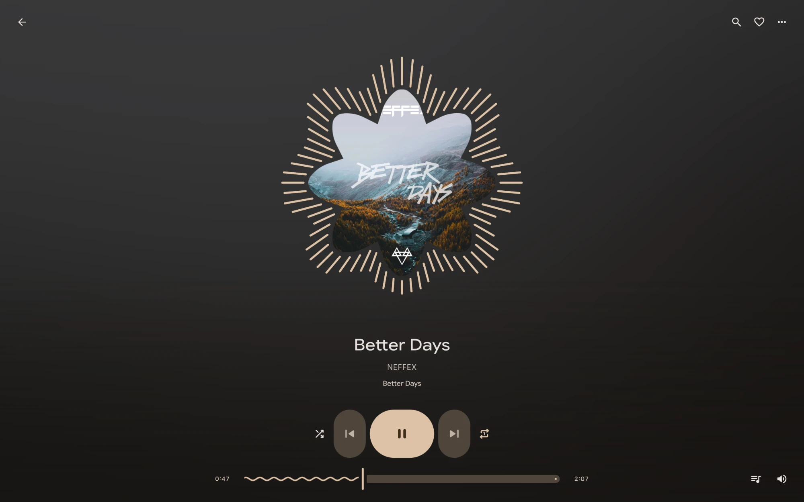

<div align="center">



<a href="https://buymeacoffee.com/e_gurl">
  
</a>

# Sung

**YouTube Music, your music files, and your music server. Native on Linux.**

[](LICENSE)


A minimal Material 3 player built with C++ and Qt Quick, designed for CachyOS and Wayland.

[Install](#install) · [Features](#features) · [Development](#development)

</div>

## Features

- **YouTube Music** — search songs, albums, artists and playlists; play audio without an embedded browser or ad interface.
- **Navidrome / Subsonic** — browse and search your server, play original or transcoded audio, edit server playlists, rate songs, sync favorites and listening history, and display server lyrics.
- **Your music** — import FLAC, MP3 and other supported audio files or folders. Mix local and YouTube songs in the same playlists.
- **Lyrics** — synchronized lyrics, an immersive view, timing adjustments, LRC import, seek previews and search with jump-to-line playback.
- **Library tools** — likes, listening history, smart mixes, custom smart playlists, automatic playlist covers, playlist cleanup, multi-selection, drag reordering and Undo.
- **Playback controls** — mini player, queue editing with source headings, shuffle, repeat, sleep timer, playback speed and audio-device selection.
- **Desktop integration** — media keys through MPRIS, optional notifications, light/dark themes and Noctalia palette support.

Native rendering, one audio decoder and bounded artwork caches keep Sung lightweight. Animations can be disabled in Settings.

## Install

### CachyOS / Arch Linux

Install the build and runtime dependencies:

```bash
sudo pacman -S --needed git base-devel cmake ninja python nodejs ffmpeg qt6-base qt6-declarative qt6-multimedia qt6-svg qt6-wayland
```

Download and install Sung:

```bash
git clone https://github.com/yappologistic/Sung.git
cd Sung
./scripts/install.sh
```

Open **Sung** from your application menu, or run:

```bash
~/.local/bin/sung
```

Installation is per-user in `~/.local`; do not run the install script with `sudo`. Python dependencies are installed in an isolated environment. Internet access is needed during installation and for YouTube playback.

### Other Linux distributions

Install the equivalent development packages for **Qt 6.8+** (Core, Gui, Quick, Qml, QuickControls2, Multimedia, Network, DBus, Svg and Wayland), a C++20 compiler, CMake 3.24+, Ninja, Python 3 with `venv`/`pip`, Node.js 20+ and FFmpeg. Then follow the clone and install commands above.

Sung uses Google Sans Flex when installed and otherwise falls back to a system font. Noctalia is optional.

## Getting started

Search for music or paste a YouTube song or playlist link. Use **Library → Local files → +** to add files, or **Folders → Add folder…** for a whole music folder. Enter its absolute path (or `~/Music`), or use **Browse…**, then choose **Add folder**. This also works for network shares mounted as local folders and does not depend on the system folder picker. Subfolders are scanned recursively. The refresh button rescans saved folders for new and changed audio.

Create an automatic playlist from **Library → Playlists → Smart playlist**. Combine artist, title, source, liked status and last-played rules over your saved music. Use **Edit rules** to change it; matching songs update automatically.

Open a song’s menu for **Track details**, or type in **Settings** to find a control.

Open a song’s menu to queue it, like it or add it to a playlist. Local playlist additions skip duplicates and can be undone. Views remember their filter, sort and scroll position during the session. Open **Clean up** in a local playlist to review duplicates and missing files; removal never deletes the original audio.

| Shortcut | Action |
| --- | --- |
| Space | Play / pause |
| Ctrl+F | Focus search |
| Ctrl+J | Show the playing song in the queue |
| ? / F1 | Keyboard shortcut reference (outside text fields) |
| Ctrl+M | Toggle mini player |
| F11 | Toggle immersive player |
| Ctrl+A | Select songs in the focused list |
| Escape | Close the current view or clear selection |

### Connect a music server

Open **Settings → Music server** and enter your Navidrome or Subsonic server address, username and password. Use the server root, including any deployment subpath, without `/rest`. Use HTTPS for remote servers.

Open **Library → Music server** to browse. The main search bar searches your server while this view is open. The server menu offers library selection, playlist creation, and queue save/restore. Song menus include ratings and server playlist actions; playlists you own support rename, deletion, song removal and drag reordering.

Local playlists can mix YouTube, local files and server songs. Server playlists accept songs from that server only. One server account can be connected at a time. Server lyrics use synchronized lyrics when available, otherwise plain text.

**Remember in desktop keyring** uses `secret-tool` (the `libsecret` package on Arch) and a running Secret Service provider. If the keyring is unavailable, the connection works for the current session. Passwords and authenticated URLs are not saved in library exports. Disconnect removes the saved login.

Connection settings include audio quality and server listening history. Original audio is buffered on disk before playback, with a 512 MiB limit per song; choose a lower bitrate for very large files. Server transcoding must be available for the selected bitrate. Listening history is submitted after half a song or four minutes of playback, whichever comes first; private listening disables submission.

Tested against Navidrome 0.63.2. Other servers must support Subsonic 1.16.1 token authentication and JSON responses. OpenSubsonic lyrics and form POST are detected when available. Server administration, video and podcasts are outside this integration.

### Accounts and saved data

YouTube browsing is anonymous. YouTube likes, local playlists and local history are stored locally and **do not sync with your Google account**. Settings offers library JSON import/export; audio files and imported LRC files are not bundled into exports.

For streams requiring sign-in, Settings can import a user-selected Netscape-format cookie file. Sung does not read your browser profile. Cookies can be removed in Settings.

Library data is stored in `~/.local/share/Sung/sung/`, settings in `~/.config/Sung/`, and cache in `~/.cache/Sung/sung/`. Standard XDG directory overrides are respected. Sung has no analytics or telemetry. Optional LRCLIB lyric lookups send the song’s title, artist and duration; they can be disabled in Settings.

### Troubleshooting

Playback depends on YouTube availability, region and network conditions. Sung buffers audio before playing, so starting a song can take a moment. It does not remove sponsor segments embedded in recordings or promise gapless playback.

If YouTube playback stops working after an upstream change, update the resolver:

```bash
~/.local/lib/sung/runtime/bin/python -m pip install --upgrade 'yt-dlp[default]' ytmusicapi
```

To update Sung, quit the player, then run `git pull` and `./scripts/install.sh` from this checkout. To uninstall, run `./scripts/uninstall.sh`; your library and settings are kept.

## Development

Build and run from the checkout:

```bash
./scripts/setup.sh
./scripts/build.sh
./scripts/run.sh
```

Run automated tests:

```bash
./scripts/test.sh
./scripts/verify.sh --offline
```

The full integration suite is `./scripts/verify.sh`. It needs network access, a working audio session, Google Sans Flex, Qt Test, `qdbus6` and `dbus-run-session` (`qt6-tools` and `dbus` provide the command-line tools on Arch). It briefly plays audio at low volume and uses isolated test profiles.

Reports and screenshots are written to the ignored `verification/` directory. Do not attach raw logs or cookie files to issues; playback logs may contain signed media URLs. The Git allowlist keeps build outputs, runtime environments, personal media and development reports out of the repository.

To test the server integration, build the test targets and provide a Navidrome executable:

```bash
./scripts/test.sh
python3 tests/navidrome_integration.py \
  --navidrome /path/to/navidrome \
  --test-binary build-tests/sung-subsonic-tests \
  --output verification/navidrome
```

The script starts a loopback-only server, creates a temporary account and 105 generated audio fixtures, and tests browsing, playback, seeking, lyrics, playlist edits, ratings, favorites, queue restoration and scrobbling. It stops the server and removes its temporary data afterward. Use a new output directory for each run. With a diagnostics build, add `--ui-binary /path/to/sung` to exercise the rendered interface too.

## License

[MIT](LICENSE). Material Symbols are licensed under Apache-2.0; see [NOTICE](NOTICE) for third-party acknowledgments. Sung is an independent project and is not affiliated with Google or YouTube.
